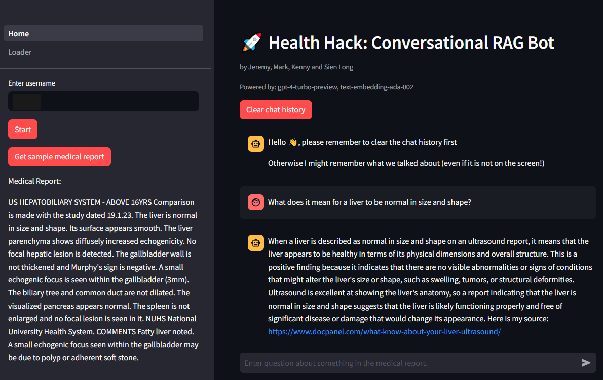
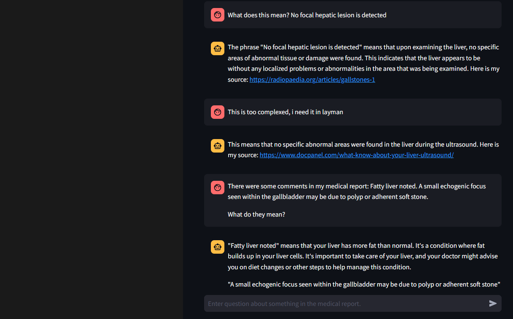
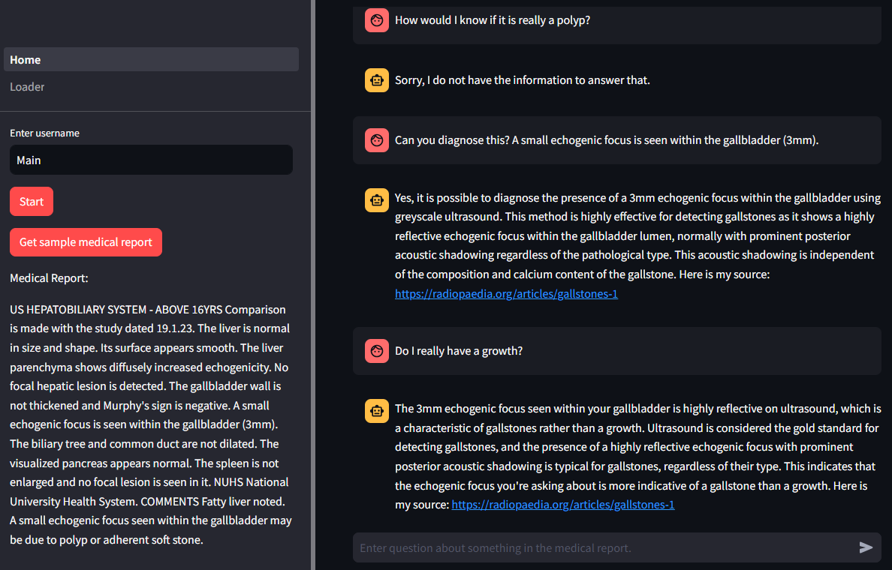

# Health Hack Project - Conversational RAG Bot
 
 

This project was created for Health Hack Hackathon 2024. It is about creating a conversational assistant for explaining medical reports in medical education. The solution is to build a Conversational Assistant, such that after a patient’s initial consultation with the doctor, one can access the tool to self-help on questions about the medical report. This acts as a second layer of FAQ after healthcare professions. The solution utilizes GPT4-preview and OpenAI's embedding model to build a Conversational Retrieval Augmented Generation App. The underlying LLM will refuse to diagnose patient or give out of context answers, lowering the chances of hallucinations.

<a href=https://youtu.be/YRcP2JbHZoQ>Project presentation</a>

Domain areas include:
- Document splitting
- Embeddings (OpenAI)
- Online vector database (Pinecone API)
- Semantic search
- Retrieval chain via LangChain Expression Language (LCEL)
- Conversational memory
- Metadata retrieval

## Upcoming works:
- Add pdf ingestion

### 20240204:
- Added retrieval for top k source link
- Document merging added in notebook, but not in app yet, need to find a cleaner way to merge and still return source documents
- Optimized login process
- Allowed for a quick sample to be retrieved on sidebar
- Loaded multiple websites with information related to medical report and did user testing

### 20240128:
- Optimized chat to always show user prompt as soon as sent
- Updated logger to log conversation history before clearing the chat

### 20240127:
- MVP1
- Completed conversation page and uploading page